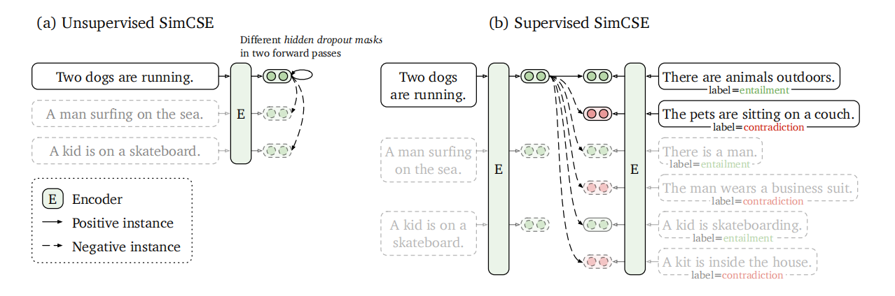
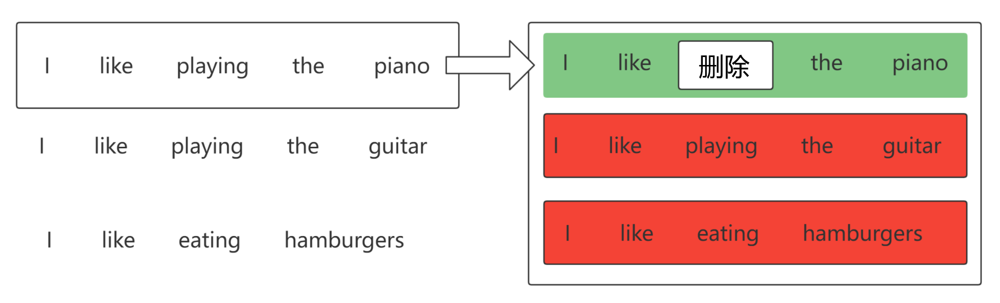
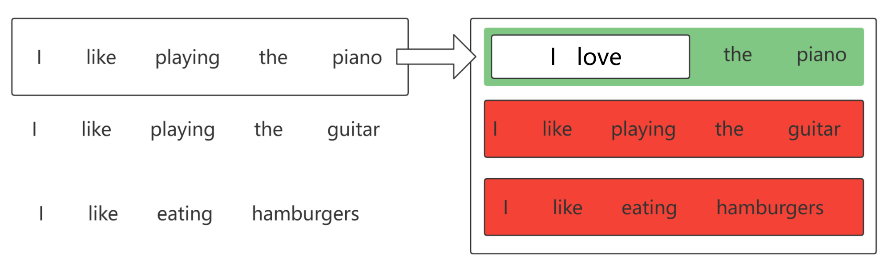
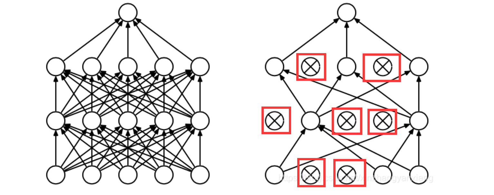
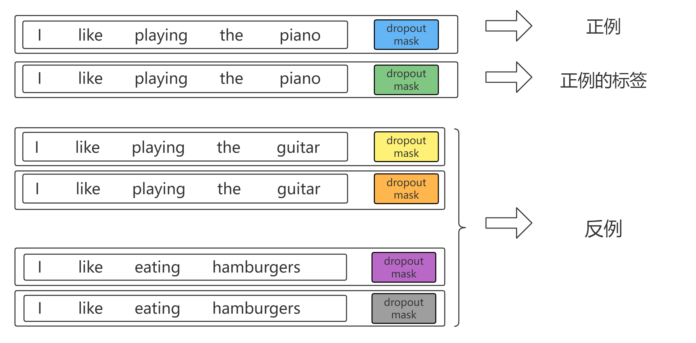
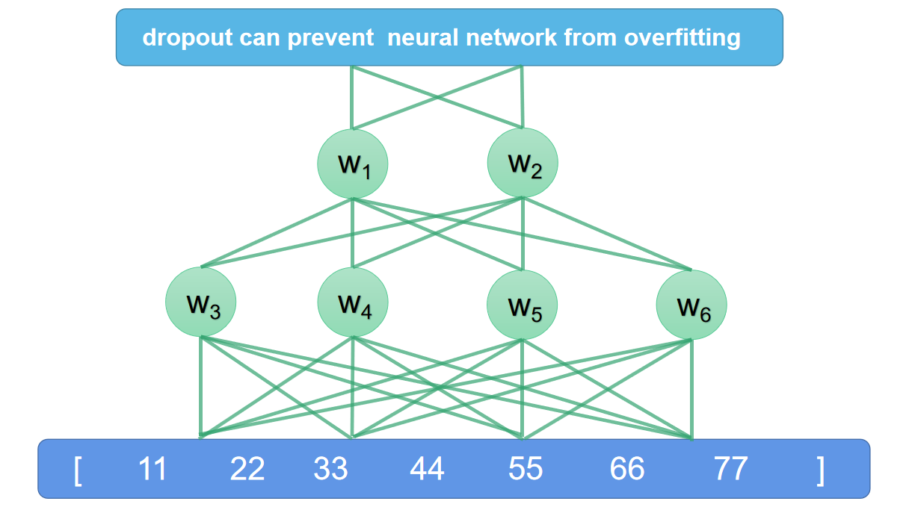
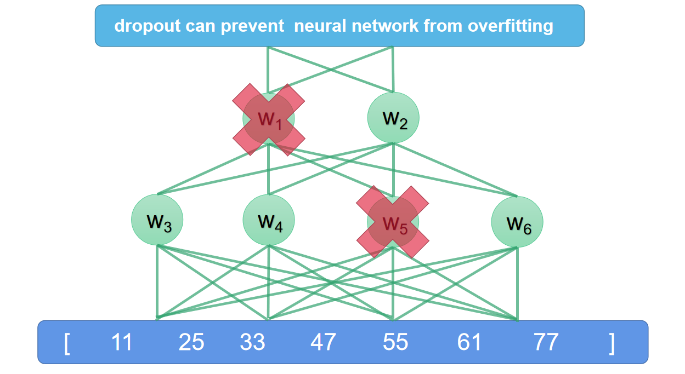
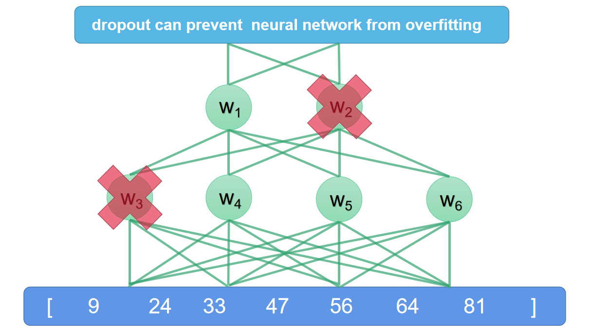

# SimCSE: Simple Contrastive Learning of Sentence Embeddings



## 概念：对比学习

**为什么引入对比学习？**

* 对于句子编码来说，我们希望相似的句子编码在空间中更加靠近，不相似的可以离得很远，这样在计算相似度时，我们可以更加明显的看到句子与句子之间的差异性和相同性。对比学习就是为了拉近正样本的距离，拉开负样本的距离；让相似的句子靠的更近，不相似的句子离得更远

> 原文摘录：Contrastive learning aims to learn effective representation by pulling semantically close neighbors together and pushing apart non-neighbors.

**对比学习需要实现的效果？**

* 学习一个编码器，当使用这个编码器进行句向量的编码时，可以让相似句子之间的编码更加接近，让不同种类数据的编码结果尽可能不同

> 原文摘录：a simple contrastive learning framework that greatly advances the state-of-the-art sentence embeddings.


## 无监督学习（dropout used as noise）

### 以前的做法？

* 类似于有监督学习，通过扩增句子来标注数据；

> 原文摘录：this approach outperforms training objectives such as predicting next sentences (Logeswaran and Lee, 2018) and discrete data augmentation (e.g., word deletion and replacement) by a large margin

以下图为例，我们需要删除单词或者替换同义词来扩增数据作为标签，从而进行训练：






### 这样做有什么缺点？

* 扩增的数据会丢失部分语义，不能最大程度保留原句的意思；本质上来说，“扩增”的代价是损失原句语义；

还是以上图举例，我们可以明显的看到，当将 `I like playing the piano` 中的 `playing` 去掉，其实我们并不能完全确定句子的意思，可能这个减去的单词是 `washing` ，又或者是 `fixing` ，那么相对于 `playing` 来说，这个句子在处理后已经损失了部分语义，将这种句子作为标签会在一定程度上影响模型的判断。


### 什么是dropout?

简单的来说， $dropout$ 是一个过程，它存在于 $Bert$ 的源码中；在编码时我们会适当的放弃一些神经元（参照下图），这样可以预防过拟合的发生，如果大家想有更具体的了解可以参考 $论文^①$ 



为了方便大家值观的理解，这里给出 $Bert$ 中有关 $dropout$ 的源码，我们在 $BertEmbeddings$ 的编码中很容易就能找到 $dropout$ 这一个过程，这是 $BertEmbeddings$ 中自带的： 

```python
class BertEmbeddings(nn.Module):
    """Construct the embeddings from word, position and token_type embeddings."""
    def __init__(self, config):
        super().__init__()
        self.word_embeddings = nn.Embedding(config.vocab_size, config.hidden_size, padding_idx=config.pad_token_id)
        self.position_embeddings = nn.Embedding(config.max_position_embeddings, config.hidden_size)
        self.token_type_embeddings = nn.Embedding(config.type_vocab_size, config.hidden_size)
        self.LayerNorm = nn.LayerNorm(config.hidden_size, eps=config.layer_norm_eps)
        # dropout的体现
        self.dropout = nn.Dropout(config.hidden_dropout_prob)
```

> ①：Nitish Srivastava, Geoffrey Hinton, Alex Krizhevsky,Ilya Sutskever, and Ruslan Salakhutdinov. 2014.**Dropout: a simple way to prevent neural networks from overfifitting**. *The Journal of Machine Learning* *Research (JMLR)*, 15(1):1929–1958.


### $SimCSE$怎么处理？

* 在扩增数据的时候将 $dropout$ 作为噪声添加

> 原文摘录：Our *unsupervised* SimCSE simply predicts the input sentence itself with only *dropout* (Srivastavaet al., 2014) used as noise (Figure 1(a)).

第一次理解 “将 $dropout$ 作为噪声添加” 可能不够值观；我们可以站在噪声的角度去体会一下，噪声（ $dropout$ ）就像是在句子后面加了点东西，但是这种"扩增"方式并不会改变或是减少句子本身的意思，这也正是噪声意义的体现！

参考下图，我们可以看到对于原句子来说，我们没有向以前的方法一样剪切或是替换，而是加入噪声；这样最大程度上减少了句子语义的损失：




> 原文摘录：In other words, we pass the same sentence to the pre-trained encoder *twice*: by applying the standard dropout twice, we can obtain two different embeddings as “positive pairs”. Then we take other sentences in the same mini-batch as “negatives”, and the model predicts the positive one among negatives.


需要注意的是，这里的“噪声”比较特殊，通过上述的介绍我们知道 $dropout$ $mask$ 本身就会出现在 $BERT$ 模型中，由于 $dropout$ 的随机性，我们只需要将句子传入 $BERT$ 编码器两次，产生的编码就已经是作者文章中陈述的：**经过 $dropout$ $mask$ 添加噪声后的自预测数据**


我们通过下面的三张流程图来理解 $dropout$ 的过程

* 首先将 `dropout can prevent neural network from overfitting` 作为句子输入，如果没有 $dropout$ ,可以假设产生了 `[11,22,33,44,55,66,77]` 的句向量编码



 

* 由于 $BertEmbeddings$ 中自带的 $dropout$  ，那么我们对句子 `dropout can prevent neural network from overfitting` 进行编码，可以得到一个 $dropout$ 处理过的句向量 `[11 25 33 47 55 61 77]`

 


* 由于 $dropout$ 的随机性，再次传入的句子便会产生不同于第一次编码的结果`[9 24 33 47 56 64 81]`



* 最终产生的两个编码就是文章中所陈述的：**以 $dropout$ 作为噪声的相同句子的不同编码**


### $SimCSE$​中无监督学习损失函数的构建


$$
l_i=-log\frac{e^{\frac{sim(h_i,h^+_i)}{\tau}}}{\sum_{j=1}^Ne^{\frac{sim(h_i,h^+_j)}{\tau}}}
$$

$$
loss = \frac{1}{N}{\sum_{i=1}^N·l_i}
$$


其中 $h_i$ 和 $h_i^+$ 便是相同句子的不同 $dropout$ ；$N$ 为 $batch$ $size$ 的大小；

这是对比学习框架中损失函数的构建，可以看到在交叉熵损失函数的基础上，作者加入了 $\tau$  温度超参数，当温度系数很小时，越相似（越困难）的负例，对应的 $\frac{sim(h_i,h^+_j)}{\tau}$ 就会越大，在分母叠加项中所占的比重就会越大，对整体loss的影响就会越大

温度超参数的引入让句向量在对比学习中的差异被扩大，从而提高句子所蕴含的语义丰富度


## 有监督学习（builds upon a success NLI dataset）

### 以前的做法？

* 在训练数据的时候会将其作为三分类任务训练（蕴含，中立，矛盾）

> 原文摘录：Unlike previous work that casts it as a 3-way classification task (entailment, neutral and contradiction)

* 面对数据集中的的每一个句子，标注者需要手动加入三个句子，分别是对前者的蕴含、中立、矛盾句子

> 原文摘录： In NLI datasets, given one premise, annotators are required to manually write one sentence that is absolutely true (*entailment*), one that might be true (*neutral*), and one that is defifinitely false (*contradiction*).


### 以前做法的缺点？

* 对于每一个新的数据集来说，需要标注大量数据（蕴含、中立、矛盾），人力成本高，费时费力

* 如果数据集的标注量少，那么训练的质量就会大打折扣

* 对于训练中的每一个句子来说，它所参考的只有自己标注的句子

  * 就上述的缺点举例：

    | sentence   | entailment     | neutral         | contradiction              |
    | ---------- | -------------- | --------------- | -------------------------- |
    | I like dog | l love dog.    | Dog is running. | I hate dog                 |
    | I want ps5 | I will buy ps5 | ps5 is nice     | ps5 will make you addicted |

    放在以前的学习过程中，`l like dog` 和 `I want ps5` 的标注数据（蕴含、中立、矛盾）是没有任何交互的，这很可能导致当几个句子都含有相同的单词时，产生的句向量会非常相似，但实际上这些句子只是有一些共同的单词而已，句子的意思却大相径庭。


### $SimCSE$现在怎么做？

* 作者的有监督学习建立在一个非常优秀的 $NLI$ 数据集基础之上


> 原文摘录：Our *supervised* SimCSE builds upon the recent success of using natural language inference (NLI) datasets for sentence embeddings (Conneau et al.,2017; Reimers and Gurevych, 2019) and incorporates annotated sentence pairs in contrastive learning (Figure 1(b)).

* 作者利用该数据集本身所携带的"蕴含"和"矛盾"标签作为正负例进行训练，通过对比学习框架训练好一个高质量的编码器，并且迁移学习后的效果达到了 $SOTA$

> 原文摘录：we leverage the fact that entailment pairs can be naturally used as positive instances. We also find that adding corresponding contradiction pairs as hard negatives further improves performance. 

* 因为有优秀 $NLI$ 数据集的支持，在迁移学习后减少了标注句子的成本
  * 什么是迁移学习？
    * 用 A 数据集训练好的模型 a ，将模型 a 用在数据集 B 上
    * 可以解决标注数据的稀缺性，即使数据集 B 没有很多的标注数据，但还是可以享受数据集 A 带来的收益
* 即使少量的标注数据，也能训练出优秀的模型。


### $SimCSE$​ 有监督学习的损失函数


$$
l_i=-log\frac{e^{\frac{sim(h_i,h^+_i)}{\tau}}}{\sum_{j=1}^N(e^{\frac{sim(h_i,h^+_j)}{\tau}}+e^{\frac{sim(h_i,h^-_j)}{\tau}})}
$$

$$
loss = \frac{1}{N}{\sum_{i=1}^N·l_i}
$$


其中 $h_i$ 和 $h_i^+$ 是句子和正例标注句子； $h_i$ 和 $h_i^-$ 是句子和负例标注句子； $N$ 为 $batch$ $size$ 的大小；

通过损失函数我们可以很直观的去体会 $SimCSE$ 有监督学习的优势，它可以把句子之间的标注数据（正例、负例）进行对比，从而提高原句句向量的表达，这就达到了标注数据之间的交互；上面的缺点我们也提到了：**以前的标注数据是没有任何交互的，这很可能导致当几个句子都含有相同的单词时，产生的句向量会非常相似，但实际上这些句子只是有一些共同的单词而已，句子的意思却大相径庭。** 但由于对比学习的运用，很好的解决了这一个问题，也使得通过 $SimCSE$ 方式训练出来的编码器可以更大程度上去区分伪正例（及那些非常相似但又不同的句子）


## 思考：为什么用 $SimCSE$ ？

* 对比学习框架的引入可以让产生的句子向量包含更丰富的语义（更优秀的句向量）

  > 原文摘录：We present $SimCSE$, a simple contrastive sentence embedding framework, which can produce superior sentence embeddings, from either unlabeled or labeled data.

* 解决了以前无监督学习句子扩增时丢失语义的痛点

* 对于有监督学习来说，基于高质量 $NLI$ 数据集进行训练减少了语义文本相似性数据集标注数据的成本，在减少成本的同时还能达到较高的效果

* 在有监督任务中，对比学习加强了标注数据之间的交互，这使得产生的句向量更加准确
